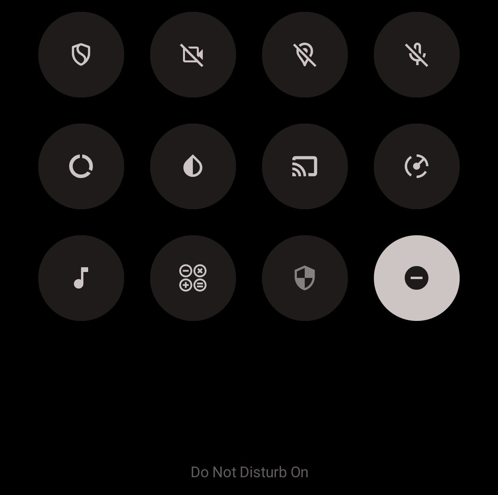

# One Tap DND

Google removed the one-tap Do Not Disturb toggle from Quick Settings in Android 15, replacing it with a "Modes" panel that takes two taps. This brings it back.

## How it works

The app adds a custom Quick Settings DND tile. Tap to toggle DND.



## Setup

1. Install the app
2. Open it and tap **Grant DND Access** (this takes you to the system settings page where you toggle permission for the app)
3. Add the tile to your Quick Settings panel (on Android 13+, the app can do this for you with a button, but on older versions, swipe down then tap the pencil/edit icon, and drag the DND tile in)


## Permissions & Privacy

This app requires exactly **one** permission:

- **Do Not Disturb access** (`ACCESS_NOTIFICATION_POLICY`): needed to read and toggle your DND state

The app doesn't require internet access, doesn't collect data, stores nothing, and contains no ads/tracking.

[VirusTotal scan](https://www.virustotal.com/gui/file/56b6c197c37a3d95ffb5ef6b8bc6c96091fe7d2ecdc717a8399261e419e65e56)
SHA-256 `56b6c197c37a3d95ffb5ef6b8bc6c96091fe7d2ecdc717a8399261e419e65e56`


## Install

### From GitHub Releases

Download the latest APK from the [Releases](../../releases) page and sideload it onto your device.

### Build from source

```
git clone https://github.com/YOUR_USERNAME/OneTapDND.git
cd OneTapDND
./gradlew assembleRelease
```

The APK will be at `app/build/outputs/apk/release/`.

## Compatibility

- **Minimum:** Android 7.0 (API 24)
- **Target:** Android 15 (API 36)


## License

This project is licensed under the GNU General Public License v3.0. See the [LICENSE](LICENSE) file for details.
