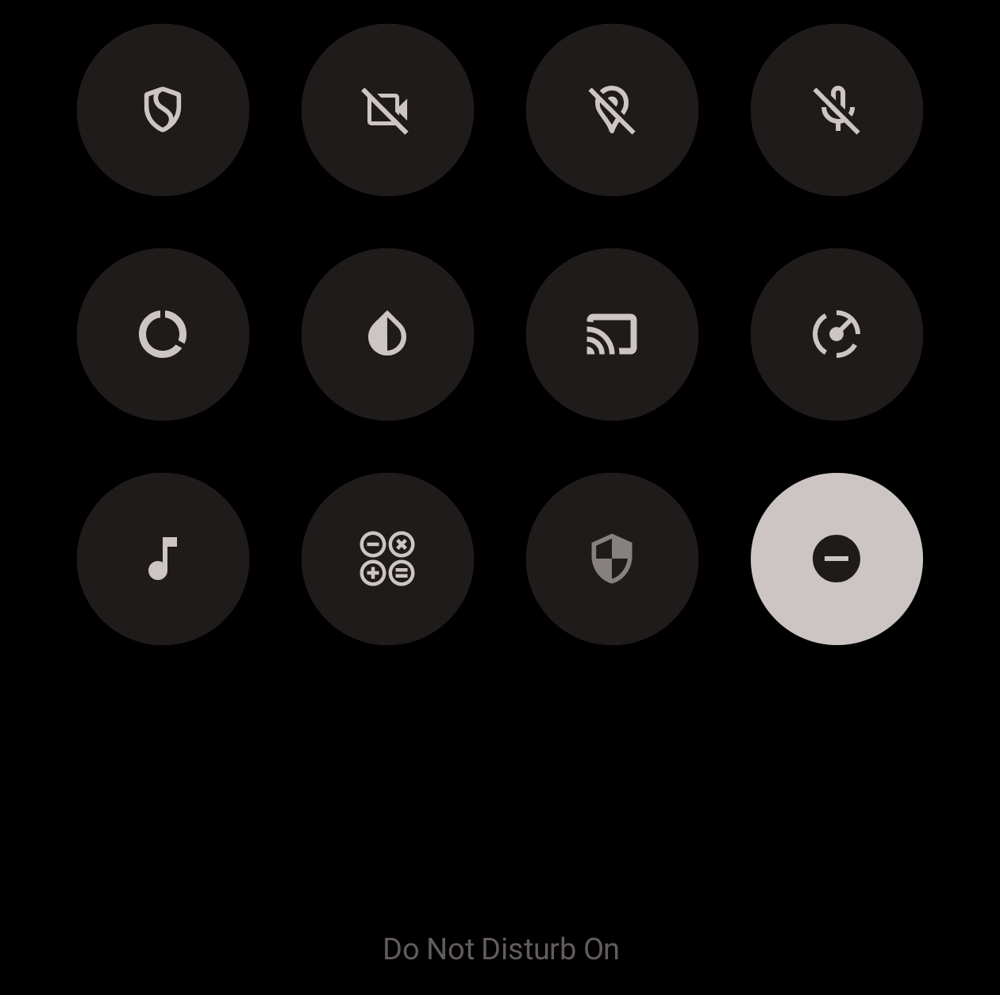

# One Tap DND

A Quick Settings tile for Do Not Disturb, with optional quiet places that activate DND when you arrive.



## Install

Download **OneTapDND.apk** from [GitHub Releases](../../releases/latest) and open it on your Android phone. Allow installation from your browser or file manager if Android asks. Releases provide one universal APK; no bundle installer is needed.

1. Open the app and grant DND access.
2. Add **Do Not Disturb** to Quick Settings. Android 13+ offers an Add Tile button; on older versions, edit Quick Settings and drag the tile into the panel.
3. Tap the tile to toggle this app's DND mode. You can close the app afterward.

The tile controls this app's rules. DND enabled by another Android mode can remain active; the tile then shows **Other mode active**. A locked phone must be unlocked before changing the tile.

## Quiet places

Choose **Add place**, search an address, read one from a screenshot, use your current location, or enter coordinates copied from a Google Maps pin. The screenshot reader recognizes addresses, place names, plus codes, and common coordinate formats, then fills the form and looks up the pin. Check the extracted text and preview the position before saving. Set a radius from **100 to 10,000 meters**; 200 meters is a practical starting point.

Choose DND for priority interruptions, or enable **Total silence** to also mute media and alarms. In-call audio is unaffected. Leaving the area ends that place's mode. Other active places and manually enabled modes remain in effect. Turning the tile off pauses places you are currently inside until you leave and return.

Grant precise location first, then choose **Allow all the time** in the app's location permission settings. Keep device Location and Google Location Accuracy on. Google Play services is required for place monitoring. Saved places are registered again after reboot, an app update, or reopening the app. Android can take a few minutes to report arrivals and departures. Force-stopping the app stops monitoring until you open it again.

Places can be edited, disabled, or deleted. The app shows monitoring failures and provides a Retry button. Disabling or deleting a place ends its active mode.

## Permissions and data

- **DND access:** controls the app's DND rules. The tile works without location permission.
- **Precise and background location:** detect arrivals and departures for quiet places, including when the app is closed.
- **Internet:** supports address lookup and the location services dependency.
- **Boot completed:** restores place monitoring after restarting the phone.

The system photo picker grants access only to the screenshot you select. Text recognition runs on the phone, and One Tap DND does not keep a copy of the image. Place names, coordinates, radii, and mode state are stored in private app storage, with backup disabled. There are no ads or analytics. Address searches, including text extracted from screenshots, use the device's geocoder provider, which can send the search to its service. Google Play services handles geofencing. Map previews send the selected coordinates to the map app or browser you open.

## Build and release

Requires JDK 21 and Android SDK 36.1. Android 7.0 (API 24) is the minimum; the target is Android 16 (API 36).

```sh
./gradlew testDebugUnitTest lintDebug assembleDebug
```

For a signed release, set `ONETAP_KEYSTORE`, `ONETAP_STORE_PASSWORD`, `ONETAP_KEY_ALIAS`, and `ONETAP_KEY_PASSWORD` in your local environment, then run:

```sh
./gradlew testDebugUnitTest lintRelease assembleRelease
```

The signed APK is `app/build/outputs/apk/release/app-release.apk`. Without signing variables, release builds are unsigned and cannot be installed directly. Keep the existing release key to support updates over earlier versions. Never commit signing keys or passwords.

The GitHub release workflow runs for version tags, or manually for an existing tag. Configure repository secrets `ANDROID_KEYSTORE_BASE64`, `ANDROID_STORE_PASSWORD`, `ANDROID_KEY_ALIAS`, and `ANDROID_KEY_PASSWORD`. The workflow checks the APK signature, version, and constructors needed by WorkManager, then attaches a single **OneTapDND.apk** to the release. Release notes come from `RELEASE_NOTES.md`.

For local release checks, run `python scripts/check_release_apk.py <apk> --dexdump <sdk>/build-tools/36.1.0/dexdump` (use `dexdump.exe` on Windows). This inspects the optimized APK to detect missing database or worker constructors before installation.

Instrumentation tests change DND rules and should run on a dedicated test device. Run `./gradlew connectedDebugAndroidTest` with that device connected. Real arrival latency and manufacturer battery restrictions still need testing on a phone.

## License

GNU General Public License v3.0. See [LICENSE](LICENSE).
